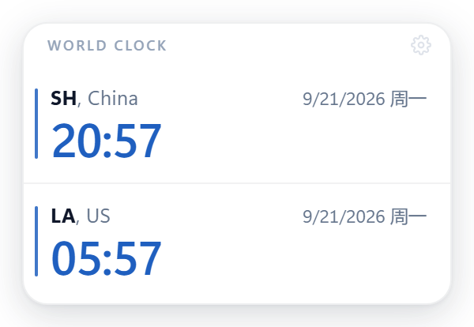
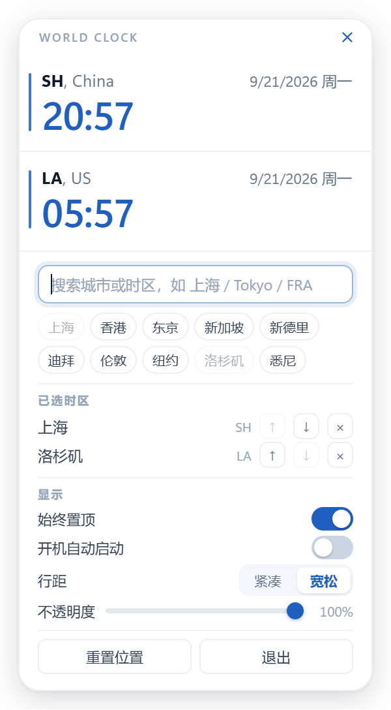

# Desktop Clock

A lightweight, always-on-top desktop world clock. Pick the time zones you care about and
keep them visible in a small floating window that gets out of the way of your work.

Built with Electron and plain HTML/CSS/JS — **no frontend framework, no third-party
runtime dependencies**. All time-zone maths uses the built-in `Intl` API, and the whole
UI is a few hundred lines of vanilla code.

<p align="center">
  
  &nbsp;&nbsp;
  
</p>

## Features

- **Always on top** — the window floats above other applications so your reference times
  are never buried. Uses the `screen-saver` window level on Windows, which is what keeps
  it above the taskbar.
- **280 time zones covering all 195 countries** — search by city, country, IANA zone name,
  or Chinese name. Ten common cities are one click away as presets.
- **Content-driven sizing** — the window sizes itself to fit exactly what is displayed.
  Toggling the settings panel grows it; collapsing it shrinks back.
- **Position persistence** — the window remembers where you put it, and validates that
  position against your current monitor layout. If you unplug a display, it relocates to
  a visible corner instead of opening off-screen.
- **Customisable** — opacity, comfortable/compact density, and app-wide light styling
  (`#1f5fbf` accent) tuned to read well on a light desktop.
- **Tray integration** — hide/show, toggle always-on-top, reset position, quit.
- **Launch at login** — optional, off by default.
- **Minimal footprint** — a hidden-window renderer would have its timers throttled by
  Chromium to once per minute, so the minute ticker lives in the main process and
  realigns itself to the minute boundary.

## Download

Grab the latest build from the [**Releases**](https://github.com/xuyihan0207/desktop-clock/releases) page.

| Platform | File | Notes |
|---|---|---|
| Windows | `Desktop Clock-Setup-1.0.0.exe` | Installer. Per-user, no admin rights needed. |
| Windows | `Desktop Clock-Portable-1.0.0.exe` | Single file, no installation. |
| macOS | `Desktop Clock-1.0.0-arm64.dmg` | Apple Silicon (M-series). |
| macOS | `Desktop Clock-1.0.0-x64.dmg` | Intel. |

### macOS: first launch

The macOS builds are **not code-signed or notarised** (that requires a paid Apple
Developer account). macOS will refuse to open the app on the first attempt. To run it:

1. Drag the app to `/Applications`.
2. **Right-click the app → Open**, then confirm in the dialog.
   (Or run `xattr -dr com.apple.quarantine "/Applications/Desktop Clock.app"`.)

This only needs to be done once.

> **Note on macOS support:** the app was developed and tested on Windows. The macOS build
> is produced by CI and compiles and launches, but the window behaviour — always-on-top
> level, transparency, and skipping the Dock — has **not been verified on real hardware**.
> Feedback and fixes are welcome.

## Usage

- **Move the window** — drag anywhere on the card background.
- **Settings** — click the gear icon (top right). It is faint until you hover it.
- **Add a zone** — open settings, type in the search box, and click a result.
  - Search `frank` and you will get `Europe/Berlin` with a hint showing *Frankfurt*.
  - Search `夏威夷` or `hawaii` and you will get `Pacific/Honolulu`.
  - If a zone is missing from the picker, typing the exact IANA name (e.g. `Etc/GMT+8`)
    still works.
- **Remove a zone** — click the `×` next to it in the settings list.
- **Hide the clock** — right-click the tray icon.
- **Quit** — tray menu → 退出, or the quit button in settings.

Up to 12 zones can be displayed at once; the window scrolls internally beyond that.

## Development

Requires Node.js 22+.

```bash
npm install
npm start
```

On Windows you can also double-click **`start.bat`**, which installs dependencies on the
first run and then launches the app without leaving a console window behind.

There are no tests and no linter to run — the app has no build step. Source files are
loaded directly.

### Layout

```
src/main/         main process
  main.js           lifecycle, window, IPC, ticker, auto-launch
  store.js          state.json read/write with validation
  window-state.js   multi-monitor position validation
  tray.js           tray menu
  tray-icon.js      tray icon, inlined as a base64 PNG
src/preload/      contextBridge whitelist (no ipcRenderer exposed)
src/renderer/     UI
  zones.js          the time-zone dataset and search ranking
  format.js         Intl.DateTimeFormat wrappers
  app.js            rendering, settings panel, resize reporting
tools/
  make-icons.js     generates the app icons from scratch
build/            icon.png (committed) + generated icon.ico
docs/             screenshots for this README
```

### Security

`contextIsolation` on, `nodeIntegration` off, `sandbox` on, a `contextBridge` whitelist
instead of exposing `ipcRenderer`, a strict CSP, all permission requests denied, and
`window.open`/navigation blocked. The renderer makes **no network requests at all** —
`connect-src 'none'`.

## Building

```bash
npm run icons      # regenerate build/icon.ico and build/icon.png
npm run dist:win   # Windows: NSIS installer + portable exe  -> dist/
npm run dist:mac   # macOS: dmg for x64 + arm64             -> dist/
npm run dist       # both
```

Output lands in `dist/`.

`npm run icons` rasterises the app icon from code (`tools/make-icons.js`) using a
hand-rolled PNG encoder — there are no checked-in image sources and no image libraries
involved. `build/icon.png` is committed because electron-builder derives the macOS
`.icns` from it.

**The macOS build must be run on macOS.** Cross-compiling from Windows is not supported
for signing or notarisation, which is why `.github/workflows/release.yml` builds each
platform on its own runner.

## Time-zone data

`src/renderer/zones.js` holds a `META` table of 280 zones spanning all 195 countries,
each with a short code, country, and city label — so a row reads `SH, China` rather than
`Asia/Shanghai`. Zones that are not in the table fall back to a label derived from the
IANA name.

A few details worth knowing if you edit this file:

- `Etc/GMT+N` has its sign **inverted** relative to real UTC offsets (`Etc/GMT+8` is
  UTC−8). Labels are written from the measured offset, not copied from the IANA name.
- `Intl.supportedValuesOf('timeZone')` is **not** the full set — Chromium omits `Etc/*`
  and several sub-region zones that `DateTimeFormat` still resolves fine. The search
  therefore accepts an exact IANA name even when the picker does not list it.
- Hong Kong, Macao and Taiwan are labelled `HK, China` / `MO, China` / `TPE, China`.

## License

[MIT](LICENSE)
